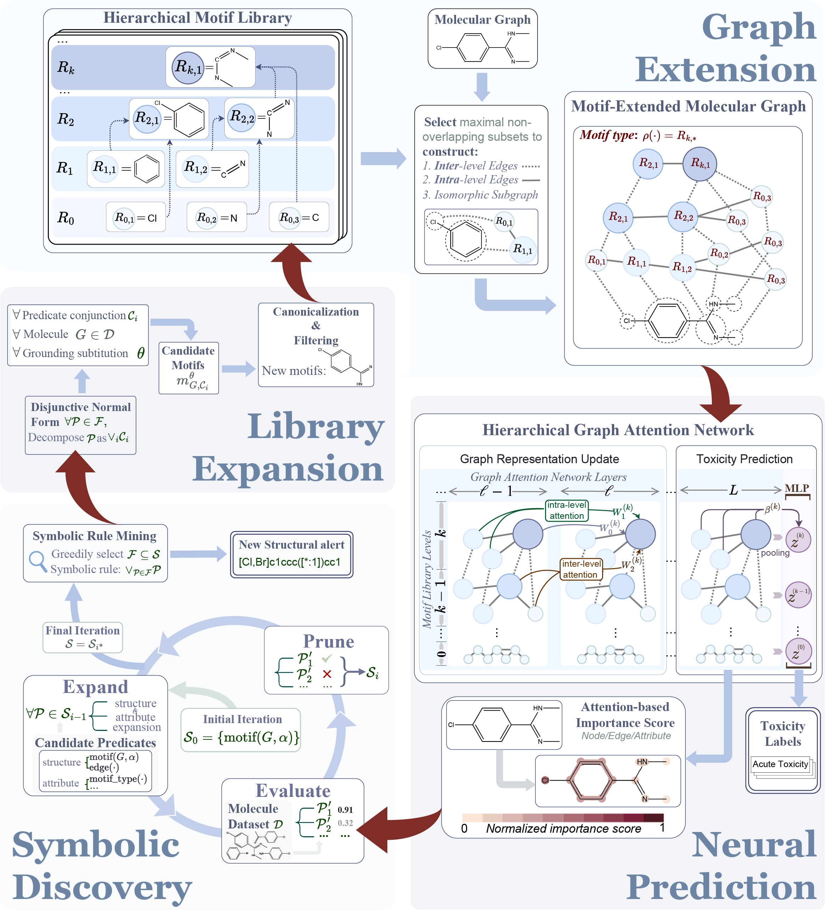

# Extraction of Structural Alerts for Molecular Toxicity using Neuro-Symbolic AI

## About
This directory contains the code and resources of the following paper:

<i>"Extraction of Structural Alerts for Molecular Toxicity using Neuro-Symbolic AI". Under review. </i>

1. NeuroSPIRAL is a neuro-symbolic framework that integrates a hierarchical motif library, motif-extended molecular graphs, and a cross-level graph attention network into an iterative pipeline that jointly improves neural toxicity prediction and symbolic rule extraction..
2. Our experimental results are based on Tox21, ToxCast from the MoleculeNet dataset and TOXRIC dataset.
3. Please contact Xuefeng Zhang osu_zxf@stu.pku.edu.cn if you have issues using this software.

## Overview of the Model
NeuroSPIRAL is built on a dynamically expandable hierarchical motif library, enabling the model to capture chemical semantics at multiple levels of complexity. These semantics are incorporated into the molecular representation by extending the molecular graph into a hierarchical graph. In the Neural Prediction panel, a graph attention network is applied to this hierarchical representation to generate neural predictions for various toxicity endpoints. As shown in the Symbolic Discovery panel, the learned attention weights guide the interpretable symbolic discovery of logical structural alerts via an iterative tree-based search. Finally, in the Library Expansion panel, frequent substructures of the discovered alerts are identified and converted into new motifs, which are incorporated into the hierarchical motif library. The evolving motif hierarchy initiates subsequent learning iterations, progressively enriching the semantic guidance available to both the neural and symbolic components.

<p align="center">
 
</p>

## System Requirements
### OS Requirements
This package is supported for Linux. The package has been tested on the following system:

Linux: Ubuntu 20.04

## Installation Guide
### Step 1. Setup the environment
We recommend to create a conda virtual environment
```
conda env create -f environment.yml
conda activate neurospiral
```

### Step 2. Run toxicity prediction tasks
To solve toxicity prediction task, run the following command to run it for Tox21 dataset.

```
python ToxerForTox21.py
```

For Toxcast dataset and TOXRIC dataset, just run

```
python ToxerForToxcast.py
python ToxerForToxric.py
```

For further details, see Online Methods of our paper. 

## License
This project is covered under the Apache 2.0 License.